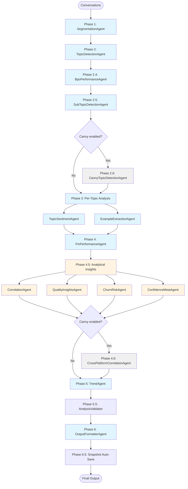

# Agent Audit Results

Comprehensive inventory and dependency mapping for every agent participating in the TopicOrchestrator workflow. All findings are based on the current production implementation in `src/agents/topic_orchestrator.py` and the individual agent modules it imports.

---

## Executive Summary

- **Total agents reviewed:** 15 active (13 core + 2 optional) + 9 legacy = 24 total modules
- **Classifications:** 9 Core · 4 Analytical · 2 Optional · 9 Legacy
- **Critical path (always executed):** Segmentation → TopicDetection → BpoPerformance → SubTopic → TopicSentiment → ExampleExtraction → FinPerformance → Trend → OutputFormatter
- **Parallel execution:** Phase 3 per-topic fan-out and Phase 4.5 analytical fan-out
- **Optional gates:** `enable_canny` controls the Canny ingestion/correlation phases
- **Supporting services (not counted as agents):** Phase 5.5 `AnalysisValidator` plus Phase 6.5 `HistoricalSnapshotService`

---

## Phase-by-Phase Breakdown

### Phase 1 — Segmentation
- **Agent:** `SegmentationAgent`
- **Output:** `paid_customer_conversations`, `free_fin_only_conversations`, `paid_fin_resolved_conversations`, `tier_distribution`, `agent_assignments`
- **Consumers:** Every downstream phase relies on the segmentation context
- **Classification:** Core
- **Orchestrator refs:** Populates `workflow_results['SegmentationAgent']` plus local lists `paid_conversations`, `free_fin_only_conversations`, `paid_fin_resolved_conversations`, and `agent_assignments` that feed BPO (Phase 2.4) and Fin payloads.

### Phase 2 — Topic Detection
- **Agent:** `TopicDetectionAgent`
- **Output:** `topic_distribution`, `topics_by_conversation`
- **Consumers:** Phase 3 per-topic fan-out, Phase 4.5 analytics, Phase 6 formatter
- **Classification:** Core
- **Orchestrator refs:** Writes to `workflow_results['TopicDetectionAgent']`, normalizes `topic_dist` and `topics_by_conv`, and injects `topics_by_conversation` into the context metadata for later phases.

### Phase 2.4 — BPO Vendor Performance
- **Agent:** `BpoPerformanceAgent`
- **Output:** `vendor_distribution`, `topic_by_vendor`, `vendor_metrics`
- **Consumers:** Phase 6 BPO reporting
- **Classification:** Core (runs once; duplicate invocation removed in prior fix)
- **Orchestrator refs:** Result stored in `workflow_results['BpoPerformanceAgent']` / `bpo_result_data`, merged into `output_previous` before the formatter and surfaced via `final_output['agent_results']`.

### Phase 2.5 — Sub-Topic Detection
- **Agent:** `SubTopicDetectionAgent`
- **Output:** `subtopics_by_tier1_topic`
- **Consumers:** FinPerformance sub-topic metrics, Output formatter
- **Classification:** Core
- **Orchestrator refs:** Normalized payload placed in `workflow_results['SubTopicDetectionAgent']`, cached as `subtopics_data`, and reattached to `fin_previous` / `output_previous` dictionaries for downstream context.

### Phase 2.6 — Canny Topic Detection (Optional)
- **Agent:** `CannyTopicDetectionAgent`
- **Output:** `topics_by_category`
- **Consumers:** Phase 4.6 `CrossPlatformCorrelationAgent`
- **Classification:** Optional (gated by `enable_canny` and presence of `canny_posts`)
- **Orchestrator refs:** Writes to `workflow_results['CannyTopicDetectionAgent']` and `canny_topics_by_category`, which are later checked before invoking `CrossPlatformCorrelationAgent`.

### Phase 3 — Per-Topic Analysis (Parallel)
- **Agents:** `TopicSentimentAgent`, `ExampleExtractionAgent`
- **Output:** Topic sentiment insights and curated conversation examples
- **Consumers:** Phase 4.5 analytics, Phase 6 topic cards
- **Classification:** Core
- **Concurrency:** Up to `max_concurrent_topics` (default 5)
- **Orchestrator refs:** Per-topic data is captured inside `workflow_results['TopicProcessing']`, `workflow_results['TopicSentiments']`, and `workflow_results['TopicExamples']`, backed by the `topic_sentiments` and `topic_examples` dicts that feed Fin, analytical, and formatter phases.

### Phase 4 — Fin AI Performance
- **Agent:** `FinPerformanceAgent`
- **Output:** `free_tier`, `paid_tier`, `subtopic_performance`
- **Consumers:** Phase 4.5 confidence meta, Phase 6 Fin section
- **Classification:** Core
- **Orchestrator refs:** Persisted in `workflow_results['FinPerformanceAgent']`, with `fin_context` / `fin_previous` carrying subtopics and segmentation data before the result is passed through `output_previous`.

### Phase 4.5 — Analytical Insights (Parallel)
- **Agents:** `CorrelationAgent`, `QualityInsightsAgent`, `ChurnRiskAgent`, `ConfidenceMetaAgent`
- **Output:** Correlation matrices, quality diagnostics, churn risk alerts, confidence/limitations
- **Consumers:** Phase 6 insight sections
- **Classification:** Analytical (executed in parallel via `asyncio.gather`)
- **Orchestrator refs:** The `feature_map` and `config.is_feature_enabled()` gates decide which entries land in `workflow_results[...]`; everything is consolidated into the `analytical_insights` dict that later becomes `output_previous['AnalyticalInsights']`.

### Phase 4.6 — Cross-Platform Correlation (Optional)
- **Agent:** `CrossPlatformCorrelationAgent`
- **Output:** `correlations_found`, `unified_priorities`, `insights`
- **Consumers:** Phase 6 Canny correlation section
- **Classification:** Optional (requires `enable_canny` and successful Phase 2.6)
- **Orchestrator refs:** Emits `workflow_results['CrossPlatformCorrelationAgent']` plus `cross_platform_insights`, both checked before formatter assembly.

### Phase 5 — Trend Analysis
- **Agent:** `TrendAgent`
- **Output:** `trends`, `historical_context`
- **Consumers:** Phase 6 trend narrative
- **Classification:** Core (lazy loads `HistoricalSnapshotService`)
- **Orchestrator refs:** Runs through the lazy `trend_agent` property, storing results in `workflow_results['TrendAgent']` and `trend_metadata` before being inserted into `output_previous`.

### Phase 5.5 — Production Data Validation
- **Component:** `AnalysisValidator`
- **Output:** `validation_warnings`, optional hard failures
- **Consumers:** Audit log, orchestrator guardrails
- **Classification:** Core safeguard (prevents silent data loss)
- **Orchestrator refs:** Executes `AnalysisValidator.validate_voc_analysis(workflow_results, ...)`, logging `validation_warnings` that are later attached to the audit trail.

### Phase 6 — Output Formatting
- **Agent:** `OutputFormatterAgent`
- **Output:** `formatted_output` Markdown for Gamma / final delivery
- **Consumers:** CLI/UI caller
- **Classification:** Core
- **Orchestrator refs:** Consumes the assembled `output_previous` dict (Segmentation, TopicDetection, SubTopic, TopicSentiments, TopicExamples, Fin, BPO, Trend, AnalyticalInsights) and stores results in `workflow_results[self.formatter_agent_name]` plus `final_output['formatted_report']`.

### Phase 6.5 — Snapshot Auto-Save
- **Component:** `HistoricalSnapshotService`
- **Output:** `snapshot_id` persisted in DuckDB for longitudinal analysis
- **Consumers:** Future TrendAgent runs
- **Classification:** Core persistence task
- **Orchestrator refs:** Uses `historical_snapshot_service.save_snapshot_async(final_output, period_type)` and appends the resulting `snapshot_id` back to `final_output`.

---

## Agent Inventory Table

| Agent Name | Phase | Classification | Status | Output Keys | TopicOrchestrator references | Safe to Remove? |
|------------|-------|----------------|--------|-------------|------------------------------|-----------------|
| SegmentationAgent | 1 | Core | Active | `paid_customer_conversations`, `free_fin_only_conversations`, `tier_distribution`, `agent_assignments` | `workflow_results['SegmentationAgent']`, `paid_conversations`, `free_fin_only_conversations`, `agent_assignments` used before BPO + Fin setup | No |
| TopicDetectionAgent | 2 | Core | Active | `topic_distribution`, `topics_by_conversation` | `workflow_results['TopicDetectionAgent']`, `topic_dist`, `topics_by_conv`, `context.merge_metadata({'topics_by_conversation': ...})` | No |
| BpoPerformanceAgent | 2.4 | Core | Active | `vendor_distribution`, `topic_by_vendor`, `vendor_metrics` | `workflow_results['BpoPerformanceAgent']`, `bpo_result_data`, `output_previous['BpoPerformanceAgent']` | No |
| SubTopicDetectionAgent | 2.5 | Core | Active | `subtopics_by_tier1_topic` | `workflow_results['SubTopicDetectionAgent']`, `subtopics_data`, `fin_previous['SubTopicDetectionAgent']` | No |
| CannyTopicDetectionAgent | 2.6 | Optional | Active | `topics_by_category` | `workflow_results['CannyTopicDetectionAgent']`, `canny_topics_by_category` (enables Phase 4.6) | No (feature-flagged) |
| TopicSentimentAgent | 3 | Core | Active | `sentiment_insight`, `sentiment_summary`, `confidence` | `topic_sentiments`, `workflow_results['TopicSentiments']`, `workflow_results['TopicProcessing'][topic]` | No |
| ExampleExtractionAgent | 3 | Core | Active | `examples` | `topic_examples`, `workflow_results['TopicExamples']`, `workflow_results['TopicProcessing'][topic]` | No |
| FinPerformanceAgent | 4 | Core | Active | `free_tier`, `paid_tier`, `subtopic_performance` | `workflow_results['FinPerformanceAgent']`, `fin_context`, `output_previous['FinPerformanceAgent']` | No |
| CorrelationAgent | 4.5 | Analytical | Active | `correlations`, `total_correlations_found` | `workflow_results['CorrelationAgent']`, `feature_map`, `analytical_insights['CorrelationAgent']` | No |
| QualityInsightsAgent | 4.5 | Analytical | Active | `fcr_by_topic`, `reopen_patterns`, `anomalies`, `exceptional_conversations` | `workflow_results['QualityInsightsAgent']`, `feature_map`, `analytical_insights['QualityInsightsAgent']` | No |
| ChurnRiskAgent | 4.5 | Analytical | Active | `high_risk_conversations`, `risk_breakdown`, `signal_distribution` | `workflow_results['ChurnRiskAgent']`, `feature_map`, `analytical_insights['ChurnRiskAgent']` | No |
| ConfidenceMetaAgent | 4.5 | Analytical | Active | `confidence_distribution`, `data_quality`, `limitations`, `what_would_improve_confidence` | `workflow_results['ConfidenceMetaAgent']`, `feature_map`, `analytical_insights['ConfidenceMetaAgent']` | No |
| CrossPlatformCorrelationAgent | 4.6 | Optional | Active | `correlations_found`, `unified_priorities`, `insights` | `workflow_results['CrossPlatformCorrelationAgent']`, `cross_platform_insights` | No (feature-flagged) |
| TrendAgent | 5 | Core | Active | `trends`, `historical_context` | `workflow_results['TrendAgent']`, `trend_metadata`, `output_previous['TrendAgent']` | No |
| OutputFormatterAgent | 6 | Core | Active | `formatted_output` | `output_previous`, `workflow_results[self.formatter_agent_name]`, `final_output['formatted_report']` | No |
| **Legacy / Unused** | | | | | | |
| orchestrator.py | N/A | Legacy | Unused | — | Not referenced in `topic_orchestrator.py` | **Yes** |
| topic_orchestrator_v2.py | N/A | Legacy | Unused | — | Not referenced in `topic_orchestrator.py` | **Yes** |
| data_agent.py | N/A | Legacy | Unused | — | Not referenced in `topic_orchestrator.py` | **Yes** |
| insight_agent.py | N/A | Legacy | Unused | — | Not referenced in `topic_orchestrator.py` | **Yes** |
| sentiment_agent.py | N/A | Legacy | Unused | — | Not referenced in `topic_orchestrator.py` | **Yes** |
| category_agent.py | N/A | Legacy | Unused | — | Not referenced in `topic_orchestrator.py` | **Yes** |
| presentation_agent.py | N/A | Legacy | Unused | — | Not referenced in `topic_orchestrator.py` | **Yes** |
| narrative_formatter_agent.py | N/A | Legacy | Unused | — | Not referenced in `topic_orchestrator.py` | **Yes** |
| agent_performance_agent.py | N/A | Legacy | Unused | — | Not referenced in `topic_orchestrator.py` | **Yes** (superseded by refactored version) |

### Supporting Services (non-agent components)

| Component | Phase | Role | TopicOrchestrator references |
|-----------|-------|------|------------------------------|
| AnalysisValidator | 5.5 | Validates production data before formatting | `AnalysisValidator.validate_voc_analysis(workflow_results, ...)` returns `validation_warnings` consumed by the audit trail and logs |
| HistoricalSnapshotService + DuckDBStorage | 5 & 6.5 | Provides historical context and snapshot persistence | Lazy `historical_snapshot_service` property powers `trend_metadata`, `historical_context`, and `save_snapshot_async(final_output, period_type)` |

---

## Output Schema Reference

### SegmentationAgent
```python
{
  "paid_customer_conversations": List[Dict],
  "free_fin_only_conversations": List[Dict],
  "paid_fin_resolved_conversations": List[Dict],
  "tier_distribution": {"free": int, "team": int, "pro": int, "business": int, "ultra": int},
  "agent_assignments": {conversation_id: {"assigned_to": str, "agent_type": str}}
}
```

### TopicDetectionAgent
```python
{
  "topic_distribution": {topic_name: {"volume": int}},
  "topics_by_conversation": {conversation_id: [{"topic": str, "confidence": float}]}
}
```

### TopicSentimentAgent (per topic)
```python
{
  "sentiment_insight": str,
  "sentiment_summary": str,
  "confidence": float
}
```

### ExampleExtractionAgent (per topic)
```python
{
  "examples": [
    {
      "conversation_id": str,
      "customer_message": str,
      "created_at": str,
      "tier": str,
      "intercom_url": str
    }
  ]
}
```

### FinPerformanceAgent
```python
{
  "free_tier": {"resolution_rate": float, "escalation_rate": float, "total_conversations": int},
  "paid_tier": {"resolution_rate": float, "total_conversations": int},
  "subtopic_performance": {subtopic: {"resolution_rate": float, "escalation_rate": float}}
}
```

### CorrelationAgent
```python
{
  "correlations": [
    {
      "type": str,
      "description": str,
      "strength": float,
      "insight": str,
      "confidence": float
    }
  ],
  "total_correlations_found": int
}
```

### QualityInsightsAgent
```python
{
  "fcr_by_topic": {topic: {"fcr": float, "sample_size": int, "observation": str}},
  "reopen_patterns": {topic: {"reopen_rate": float, "observation": str}},
  "anomalies": [{"type": str, "topic": str, "deviation_pct": int, "observation": str}],
  "exceptional_conversations": [
    {"conversation_id": str, "exceptional_in": str, "intercom_url": str}
  ]
}
```

### ChurnRiskAgent
```python
{
  "high_risk_conversations": [
    {
      "conversation_id": str,
      "risk_score": float,
      "tier": str,
      "signals": List[str],
      "quotes": List[str],
      "priority": str,
      "intercom_url": str
    }
  ],
  "risk_breakdown": {"high_value_at_risk": int, "total_risk_signals": int}
}
```

### ConfidenceMetaAgent
```python
{
  "confidence_distribution": {
    "high_confidence_insights": List[{"agent": str, "confidence": float, "reason": str}],
    "medium_confidence_insights": List[...],
    "low_confidence_insights": List[...]
  },
  "data_quality": {"tier_coverage": float, "csat_coverage": float, "impact": str},
  "limitations": List[str],
  "what_would_improve_confidence": List[str],
  "overall_data_quality_score": float
}
```

---

## Recommendations

### Safe Removals
1. `orchestrator.py`
2. `topic_orchestrator_v2.py`
3. `data_agent.py`
4. `insight_agent.py`
5. `sentiment_agent.py`
6. `category_agent.py`
7. `presentation_agent.py`
8. `narrative_formatter_agent.py`
9. `agent_performance_agent.py`

**Removal workflow:**
- Confirm no imports remain (`grep -r` for each module)
- Move files into `src/agents/legacy/` for archival
- Update `src/agents/__init__.py` exports
- Document in `MIGRATION_GUIDE.md`

### Feature Flags (Current & Potential)

**Current behavior**
- `enable_canny` is the only production flag today. It gates both `CannyTopicDetectionAgent` and `CrossPlatformCorrelationAgent` via `config.is_feature_enabled('enable_canny')` checks in `topic_orchestrator.py`.

**Proposed enhancements (not implemented)**
- Introduce dedicated Phase 4.5 toggles (`enable_correlation_analysis`, `enable_quality_insights`, `enable_churn_detection`, `enable_confidence_meta`) with CLI/Web UI controls mapped through `CANONICAL_COMMAND_MAPPINGS` and `static/app.js`.
- Extend feature toggling to other cost drivers (for example, opt-in per-topic example extraction) if additional savings are required.

### Fast-Path Proposals

**Current behavior**
- `TopicOrchestrator.execute_weekly_analysis` always executes the full Phase 1 → 6.5 workflow; no `analysis_mode` branching exists today.

**Proposed enhancements (not implemented)**
1. **Quick Topic Overview (`analysis_mode: quick`):** Skip Phases 2.5, 4.5, 5 to deliver rapid topic insights (~40% faster, 60% fewer LLM calls).
2. **Fin-Only Mode (`analysis_mode: fin_only`):** Skip Phases 2.5, 3, 4.5; retain only Fin KPIs (~60% faster, 80% fewer LLM calls).
3. **Churn Alert Mode (`analysis_mode: churn_alert`):** Focus on Phases 1, 2, `ChurnRiskAgent`, and formatting (~70% faster, targets high-risk accounts).

Implementation hooks (future work):
- Add `analysis_mode` config (for example, `config/analysis_modes.yaml`) plus CLI/Web UI options so users can opt in.
- Branch inside `TopicOrchestrator.execute_weekly_analysis` with explicit skips per mode.
- Ensure `OutputFormatterAgent` handles omitted sections gracefully before exposing the feature publicly.

---

## Critical Path Diagram



**Legend:** Blue = Core workflow · Yellow = Analytical fan-out · Gray = Optional (feature-flagged).

---

## Conclusion

The TopicOrchestrator pipeline remains cleanly segmented with well-defined responsibilities per phase. Recent fixes eliminated duplicate BPO execution, enforced feature flags, and added validation/persistence guardrails. Recommended follow-ups:

1. Relocate the 9 legacy agents to `src/agents/legacy/` and update documentation.
2. Evaluate demand for the proposed fast-path `analysis_mode` presets (not yet implemented) to reduce runtime and LLM spend before wiring them into CLI/Web.
3. When the proposed Phase 4.5 toggles ship, monitor usage carefully and keep defaults aligned with customer expectations.
4. Continue monitoring TopicSentimentAgent and ExampleExtractionAgent for optimization opportunities, as they drive the majority of LLM usage.
5. Promote the new Legacy Hilary Mode when stakeholders need V1 parity or regression checks (topic-based only).

Refer to `src/agents/topic_orchestrator.py` (Phases 1–6.5) plus the individual agent modules for source-of-truth implementations.

