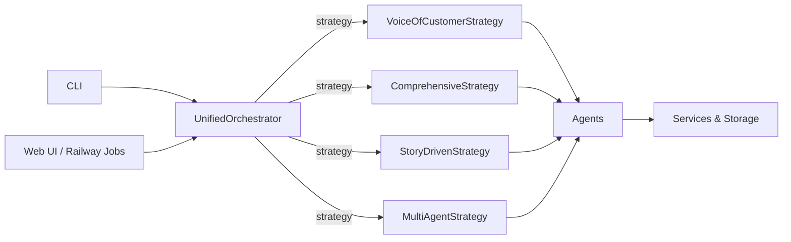

# Orchestrator Consolidation Guide

## 1. Executive Summary

The Intercom Analysis Tool historically maintained **five separate orchestrators** (Analysis, Topic, Story-Driven, Multi-Agent, and numerous CLI-specific wrappers). Each reimplemented timeout logic, checkpointing, and recovery, leading to bugs and duplicated feature work.  

**Solution:** All production code now routes through `UnifiedOrchestrator` with a pluggable strategy. Legacy orchestrators remain only as compatibility shims and emit loud deprecation warnings.

**Benefits:** Single entry point, consistent `AgentResult` contracts, faster testing, simpler migrations, and Phase 3 resilience (provider-aware semaphores, standardized timeouts, and mandatory data-quality gates).

---

## 2. Architecture Overview



- **UnifiedOrchestrator** validates `AgentContext`, measures execution time, and handles uniform error reporting.
- **OrchestrationStrategy** implementations encapsulate domain logic while inheriting retries, checkpointing, and metrics from `BaseOrchestrator`.

### Strategy Reference

| Strategy                  | Primary Use Case                                  |
|---------------------------|---------------------------------------------------|
| `VoiceOfCustomerStrategy` | Multi-agent segmentation → topic → insight flow   |
| `ComprehensiveStrategy`   | Cross-category reporting + Gamma generation       |
| `StoryDrivenStrategy`     | Narrative journeys blending Intercom + Canny      |
| `MultiAgentStrategy`      | Legacy five-agent workflow for regression tests   |

---

## 3. Legacy Orchestrators

| Legacy Wrapper              | Status      | Replacement                                                                 |
|----------------------------|-------------|------------------------------------------------------------------------------|
| `AnalysisOrchestrator`     | Deprecated  | `UnifiedOrchestrator(strategy=ComprehensiveStrategy())`                      |
| `TopicOrchestrator`        | Deprecated  | `TopicOrchestratorV2` (wraps `VoiceOfCustomerStrategy`)                      |
| `StoryDrivenOrchestrator`  | Deprecated  | `UnifiedOrchestrator(strategy=StoryDrivenStrategy())`                        |
| `MultiAgentOrchestrator`   | Deprecated  | `UnifiedOrchestrator(strategy=MultiAgentStrategy())`                         |

Each legacy wrapper delegates to the unified layer and immediately logs both `logger.error(...)` and `DeprecationWarning`. They remain solely for regression or side-by-side testing.

---

## 4. Migration Guide

### Comprehensive Analysis

```python
# Before
from src.services.orchestrator import AnalysisOrchestrator
orchestrator = AnalysisOrchestrator()
results = await orchestrator.run_comprehensive_analysis(start, end, options)

# After
from src.agents.base_agent import AgentContext
from src.services.strategies import ComprehensiveStrategy
from src.services.unified_orchestrator import UnifiedOrchestrator

context = AgentContext(
    analysis_id="comprehensive_20240101",
    analysis_type="comprehensive",
    start_date=start,
    end_date=end,
)
strategy = ComprehensiveStrategy()
orchestrator = UnifiedOrchestrator(strategy=strategy)
agent_result = await orchestrator.execute(context, options=options)
results = agent_result.data
```

### Voice of Customer (Topic) Analysis

```python
# Before
from src.agents.topic_orchestrator import TopicOrchestrator
orchestrator = TopicOrchestrator()
result = await orchestrator.execute_weekly_analysis(conversations, week_id, ...)

# After
from src.agents.topic_orchestrator_v2 import TopicOrchestratorV2
orchestrator = TopicOrchestratorV2()
result = await orchestrator.execute_weekly_analysis(conversations, week_id, ...)
# TopicOrchestratorV2 internally instantiates VoiceOfCustomerStrategy + UnifiedOrchestrator.
```

### Story-Driven & Multi-Agent

```python
story_strategy = StoryDrivenStrategy()
story_context = AgentContext(
    analysis_id="story_run",
    analysis_type="story_driven",
    start_date=start,
    end_date=end,
    conversations=conversations,
    metadata={"canny_posts": canny_posts},
)
story_orchestrator = UnifiedOrchestrator(strategy=story_strategy)
await story_orchestrator.execute(story_context, options=options)

legacy_strategy = MultiAgentStrategy(checkpoint_dir=Path("checkpoints"))
legacy_orchestrator = UnifiedOrchestrator(strategy=legacy_strategy)
await legacy_orchestrator.execute(agent_context)
```

---

## 5. CLI Integration

- CLI commands instantiate strategies directly (`src/cli/commands.py`, `src/cli/voc_commands.py`).
- `CANONICAL_COMMAND_MAPPINGS` enumerates all flags; the web UI consumes it to build safe argument lists.
- Legacy `--legacy-mode` flags intentionally route through `MultiAgentStrategy` for regression testing only.

Run `python scripts/check_cli_web_alignment.py` whenever a new flag toggles strategy behavior.

---

## 6. Testing Strategy

1. **Unit Tests** – Cover strategy helpers, especially validation (`tests/test_validation.py` now imports `ComprehensiveStrategy` directly).
2. **Integration Tests** – Use `UnifiedOrchestrator` in end-to-end flows (see `tests/integration/test_gamma_api_integration.py` for Gamma generation).
3. **Sample-Mode Gate** – Any change touching LLM prompts must pass `python src/main.py sample-mode --count 50 --save-to-file`.

When stubbing strategies in tests, patch the strategy methods (e.g., `run_comprehensive_analysis`) instead of legacy orchestrators.

---

## 7. Phase 3 Resilience Standardization

Unified orchestration made it possible to roll out Phase 3 resilience controls once and have every strategy inherit them automatically.

### Key Features

- **Provider-aware semaphores** – `get_recommended_semaphore()` enforces Anthropic/OpenAI concurrency limits for every agent (no more hardcoded `Semaphore(5)`).
- **Timeout governance** – `settings.py` defines agent-level LLM timeouts; `BaseOrchestrator._get_agent_timeout()` applies the 3× orchestration buffer.
- **Data-quality gates** – `BaseOrchestrator.log_stage_metrics()` tracks stage counts and warns on >10% drops; `VoiceOfCustomerStrategy` logs Post-Fetch, Post-Segmentation, Post-TopicDetection, and Pre-Formatting checkpoints.

### Benefits

- Prevents 429 thrashing on Anthropic Tier 1 while allowing GPT-4o to run up to 20 concurrent calls.
- Makes timeout tuning an environment tweak instead of a code change.
- Surfaces silent data loss before OutputFormatterAgent produces diluted narratives.

See `docs/PHASE_3_RESILIENCE_STANDARDIZATION.md` for the full rollout plan, migration steps, and validation tooling.

---

## 8. Future Work

- Monitor usage telemetry to determine when legacy wrappers can be removed entirely.
- Explore additional strategies (e.g., Agent Coaching audits) without cloning infrastructure.
- Automate enforcement that CLI/web paths reference only `UnifiedOrchestrator`.
- Extend Phase 3 resilience patterns to all new strategies/agents by default (validation script already enforces this).

---

### References
- `SYSTEM_ARCHITECTURE_GUIDE.md`
- `MIGRATION_GUIDE.md`
- `CLI_WEB_ALIGNMENT_CHECKLIST.md`
- `docs/CLI_COMMAND_INVENTORY.md`

